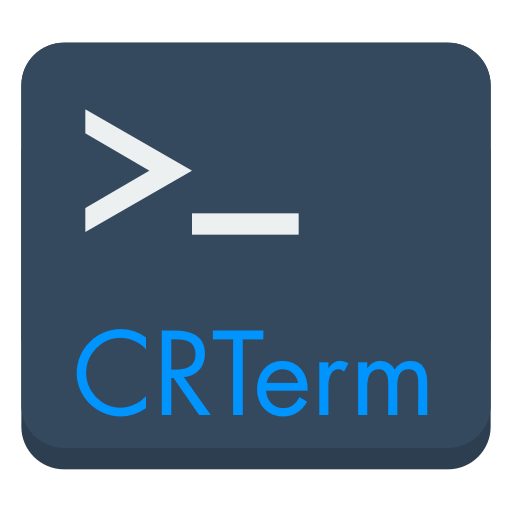
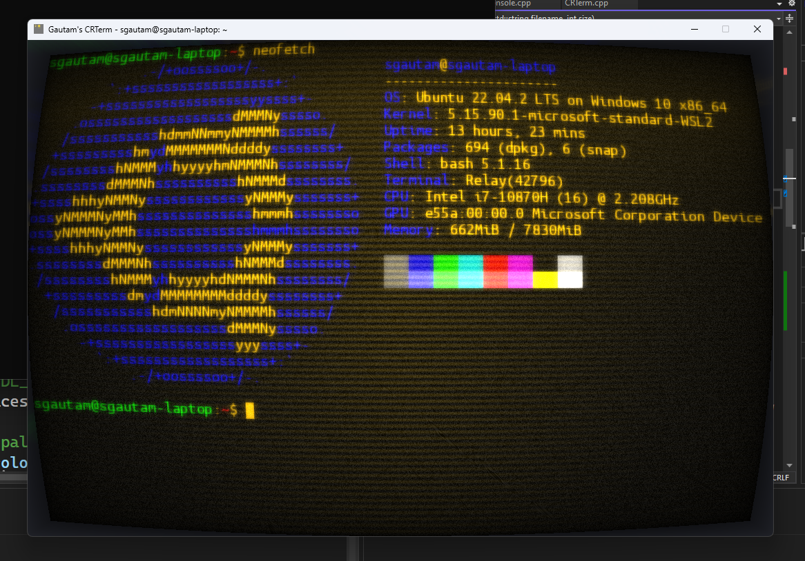
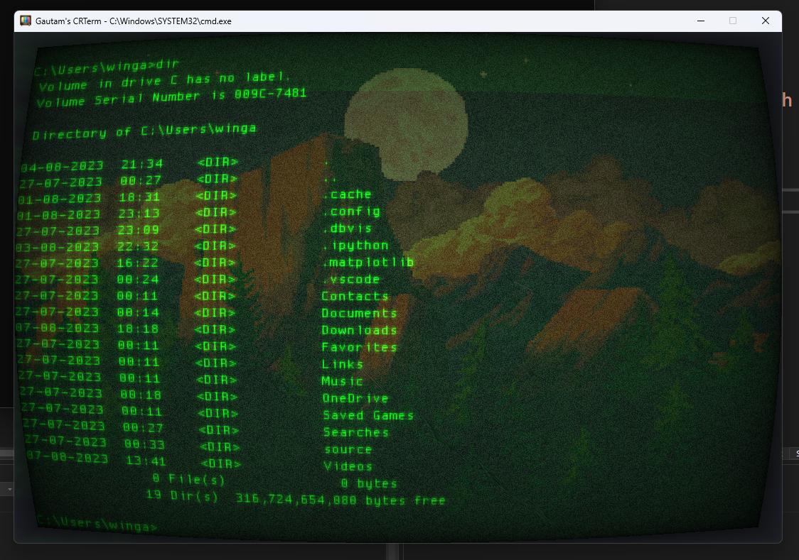

# CRTerm 
A CRT style terminal for Windows (or more appropriately, a Windows take on cool-retro-term)

<b>Note: This is a WIP, it is not ready for production!</b>

| Amber with WSL | Green with cmd.exe |
| -------------  | ------------------ |
|||

## Motivation

This project is inspired from SwordFish90's [Cool-Retro-Term](https://github.com/Swordfish90/cool-retro-term). Unfortunately, this program while being cool, was only available for Linux / MacOS, so I decided to write one for Windows.

## Description

Right now, it creates a borderless window, uses [SDL2-GPU](https://github.com/grimfang4/sdl-gpu) to set up the screen and shaders and uses Win32's ConPTY to set up the pipes to the shell program. Error handling, and other things are non-existent right now, as I said, this is still a WIP.

It does not support TrueType, instead it uses a Bitmap Font.

The terminal does not support history either. It simply scrolls.

A subset of VT100 is supported, although it is still buggy (vim for example is glitchy).

Once again, this is a WIP project.

## Planned Features

* Support for VT220
* Mouse interactivity
* Scrollback w/ history
* Multiple tabs

## Building

Visual Studio 2022 is required. Windows 10 SDK (June 2018)+ is needed as it uses CreatePseudoConsole() and ConPTY.
