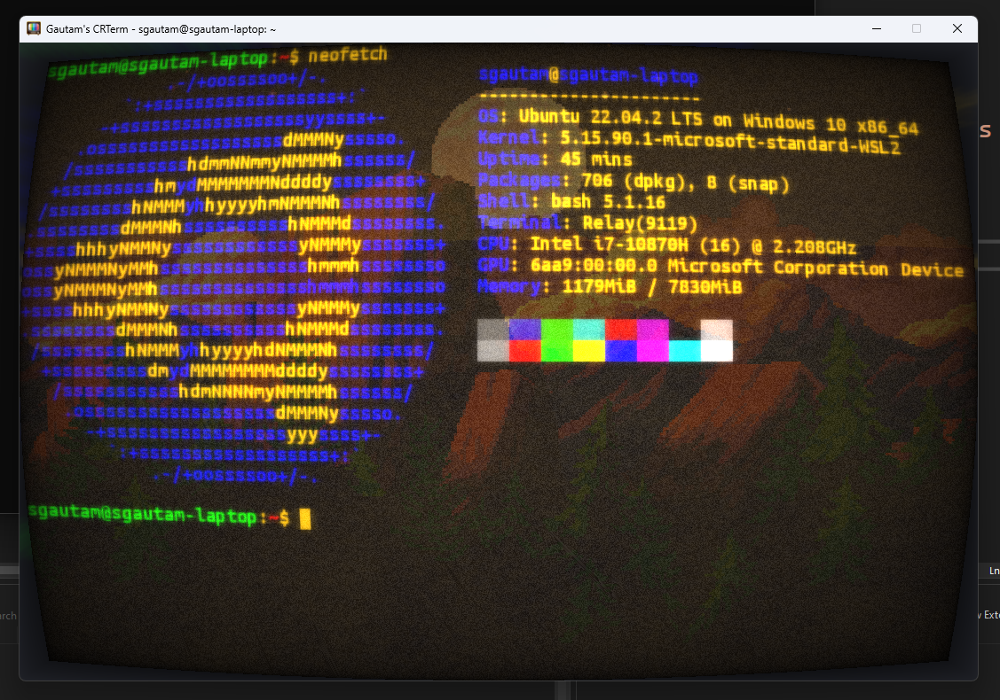

 

# Gautam's CRTerm   

A CRT style terminal for Windows. Watch it in [action](https://youtu.be/oOITpIzd7WM).

<b>Note: This is a WIP, it is not ready for production!</b>

| Amber with WSL (using Ubuntu Mono TrueType) | Green with cmd.exe | White with Powershell |
| -------------  | ------------------ | -----------   |
|||  |

## Motivation

This project is inspired from SwordFish90's [Cool-Retro-Term](https://github.com/Swordfish90/cool-retro-term). Unfortunately, this program while being cool, was only available for Linux / MacOS, so I decided to write one for Windows. 

Note that <i>while it is inspired from Cool-Retro-Term, it is not Cool-Retro-Term!</i> Cool-Retro-Term has undergone ~10 years of development and this does not use any code from that. This has gone about ~10 days in development in comparison, so once again it is in active development and will see many changes. :P

## Description

The terminal supports a subset of VT220, and uses SDL-GPU for rendering. For the UI part, it employs Dear ImGui. It uses Nlohmann's JSON library and Sam Hocevar's portable file dialogs as well. It has a 16 color palette. The mouse is used for selection, copying and pasting. It also implements a scrollback buffer which can be used to view the terminal's history.

The terminal reads the "default" file in its directory which should just contain the path to a JSON file. An example is given in default and config/ located in src/resources. 

The current version is 0.2.8, it is still in active development and may not replace your terminal application.

## Features

* Subset of VT220 is supported
* Mouse selection (copy, and paste)
* 16-color palette
* Scrollback history
* TrueType support (WIP, will come in next release)

Hey, it looks nice, if you wanted functionality, go for Windows Terminal.

## Upcoming

* UTF-8 Support
* Support for certain iTerm sequences to allow graphics rendering in the terminal

## Building

Visual Studio 2022 is required, it requires C++17. Windows 10 SDK (June 2018)+ is needed as it uses CreatePseudoConsole() and ConPTY.
